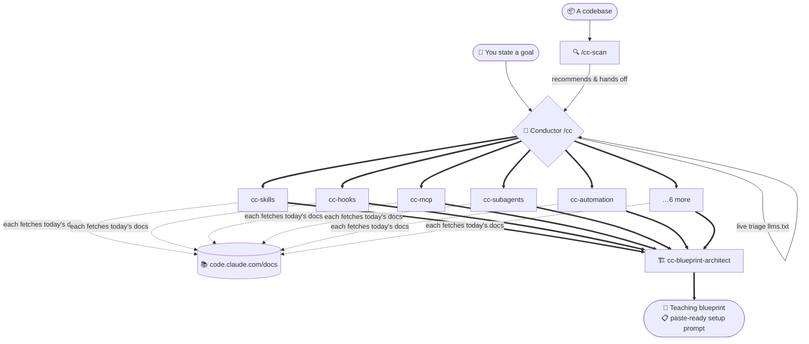

<div align="center">

# 🎼 Claude Code Expert

### A conductor plugin for Claude Code — turn any goal into the right infrastructure, verified against **live documentation**, every time.

[](LICENSE)
[](https://code.claude.com/docs/en/plugins)
[](#-the-orchestra)
[](#-why-live-docs)
[](#-contributing)

</div>

---

## ✨ What is this?

Claude Code ships changes **daily**. Most "how do I set up X in Claude Code" answers are stale the moment they're written — and an LLM answering from training data is stale by months.

**Claude Code Expert** solves this with a *conductor-and-orchestra* model. You state **what** you want to achieve. A conductor maps it to the right Claude Code mechanism and dispatches a specialist subagent — and **every specialist reads today's live documentation before it answers**, never from memory.

You always walk away with two things:

1. 🧠 **A teaching explanation** of the infrastructure — which pieces, why, and how they connect, so you *learn* the pattern.
2. 📋 **A ready-to-paste setup prompt** you can run in Claude Code on *any* project to build that exact infrastructure.

---

## 🚀 Quick start

```bash
# 1. Add this repo as a plugin marketplace
/plugin marketplace add ceekfadeblack/claude-code-expert

# 2. Install the plugin
/plugin install claude-code-expert@claude-code-expert-market

# 3. Use it
/claude-code-expert:cc        # I know what I want → design it
/claude-code-expert:cc-scan   # I have a project → tell me what to set up
```

Confirm the specialists loaded with `/agents`.

---

## 🎯 Two entrypoints

| Command | Use when… | What it does |
| :--- | :--- | :--- |
| **`/cc`** | You already know the need | Maps it → runs live specialists → returns a teaching blueprint **+** a paste-ready setup prompt. |
| **`/cc-scan`** | You have a project but don't know what to set up | Scans the codebase, proactively recommends the highest-value automations, then hands any pick to `/cc` for the full blueprint. |

> **In one line:** `/cc-scan` answers *"what should I build?"* (discovery). `/cc` answers *"how do I build it?"* (construction). When in doubt, start with `/cc-scan`.

#### Example prompts

```text
/cc Add a pre-commit hook that runs the linter and blocks secrets
/cc Connect a Postgres database to Claude Code via MCP
/cc Package my .claude/ setup into a shareable plugin
/cc Keep Claude working autonomously toward porting this module, safely

/cc-scan
/cc-scan focus on testing and CI
```

---

## 🧭 How it works



The conductor never decides from memory either: every run begins with a **live triage** of `llms.txt` + the feature inventory, so anything Anthropic shipped since yesterday is on the table.

---

## 🎻 The orchestra

11 specialists — 10 domain experts + 1 blueprint architect. Each owns a slice of the live docs and runs in its own isolated context.

| Specialist | Domain |
| :--- | :--- |
| `cc-skills-expert` | Skills, custom commands, `SKILL.md`, frontmatter |
| `cc-hooks-expert` | Hooks: events, automation, settings hooks |
| `cc-mcp-expert` | MCP servers, integrations, tools/resources |
| `cc-subagents-expert` | Subagents, agent teams, parallel/background agents, dynamic workflows |
| `cc-commands-expert` | Slash commands & built-in commands |
| `cc-settings-expert` | `settings.json`, permissions, permission modes, env |
| `cc-plugins-expert` | Plugins & marketplaces (packaging / sharing) |
| `cc-sdk-expert` | Agent SDK (Python/TS) & Claude API |
| `cc-core-expert` | `CLAUDE.md`/memory, context, output styles, model config, CLI |
| `cc-automation-expert` | Autonomous `/goal` loops, scheduled tasks, routines, run-state |
| `cc-blueprint-architect` | Synthesizes findings → teaches the design + writes the setup prompt |

The orchestra is designed to **grow**: agents map to documentation *domains*, not individual features — so a newly shipped feature is absorbed by the relevant specialist's live fetch automatically. A new specialist is added only when a whole new domain emerges.

---

## 🔄 Why live docs?

This project keeps **no cached or offline copy** of the Claude Code docs — by design. Every factual claim about a feature is backed by a live fetch of the current page this session. The **Live Source Protocol** is non-negotiable for the conductor *and* every specialist:

- Fetch the real page live, every time (raw `.md`).
- `llms.txt` is a *map* to discover current URLs — never the source of truth.
- Cross-reference: read any relevant page, not just one.
- Prove freshness: every answer cites the URLs it fetched.

Any feature hint embedded in the agents is treated as a **routing aid only** — confirmed live before it's asserted.

---

## 🛠️ Local development

```bash
claude --plugin-dir ./        # load the plugin without installing
/reload-plugins               # after edits
claude plugin validate ./     # validate before publishing
```

---

## 📁 Repository layout

```
claude-code-expert/
├── .claude-plugin/
│   ├── plugin.json            # plugin manifest
│   └── marketplace.json       # marketplace catalog (install from GitHub)
├── agents/                    # 11 specialist subagents
├── skills/
│   ├── cc/SKILL.md            # /cc — the conductor entrypoint
│   └── cc-scan/SKILL.md       # /cc-scan — codebase recommender
├── lessons.md                 # hard-won lessons the conductor reads first
└── README.md
```

---

## ❓ FAQ

**Does it modify my project?** Only after you approve. The workflow is always *explain → plan → approve → build*, and it writes only inside your project's `.claude/` directory.

**Why are the skills namespaced `/claude-code-expert:cc`?** Plugin-provided skills are namespaced on install. Run `/agents` to see the loaded specialists.

**Is my data sent anywhere?** No more than normal Claude Code usage. The specialists fetch public documentation pages; nothing about your project leaves your machine beyond what Claude Code already does.

---

## 🤝 Contributing

Issues and PRs are welcome — new specialists, sharper prompts, better lessons. Keep agent definitions in English, project-local, and faithful to the Live Source Protocol.

---

## 📜 License

[MIT](LICENSE) © Bahri Inceler
